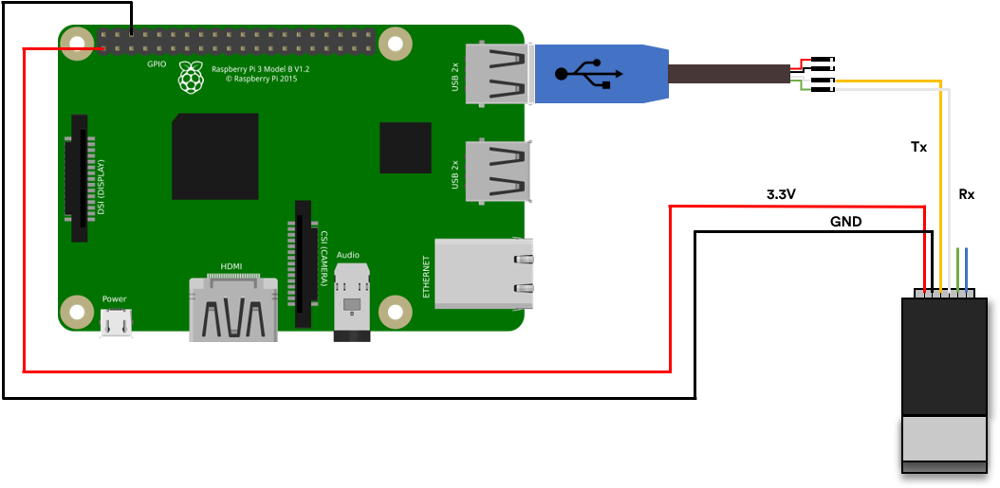
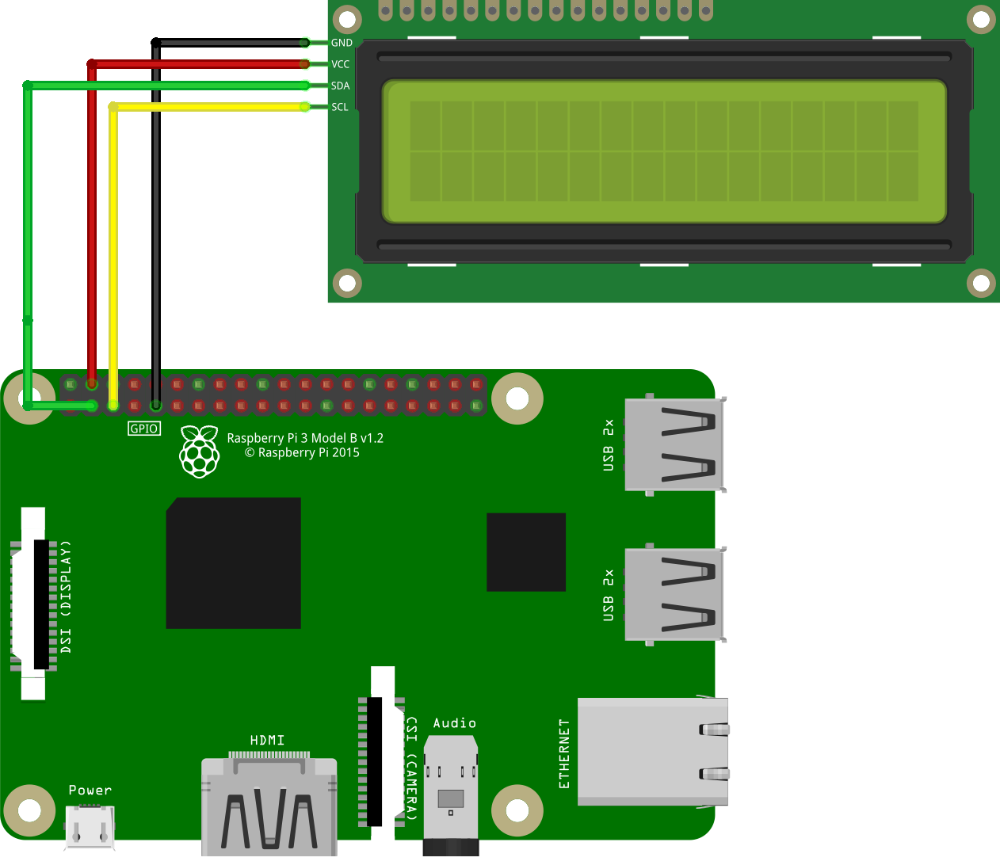
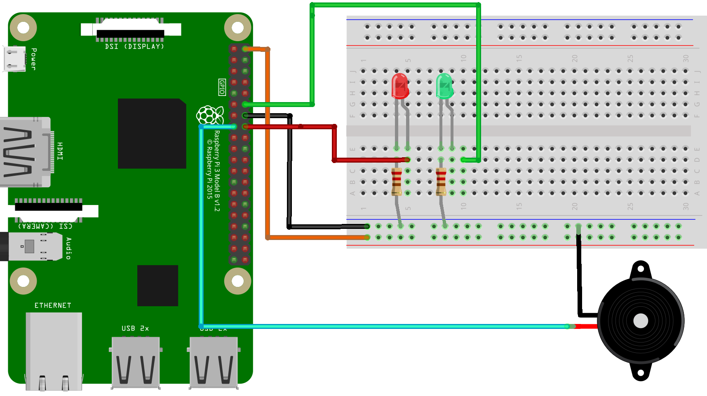

# Attfingerprint
This is an application/system that can be implemented by schools to make students mark their attendance using their fingerprints.

The architecture is divided into 3 main parts:
- **Server application:** Setup the database with different school tracks, weeks, subjects and attendance lists.
- **Client application (Raspberry Pi 3):** Enroll students with fingerprint and store their information in the server's database.
- **Main application (Raspberry Pi 3:** The actual program that will be running to monitor attendance.

You can grab the application by typing:
```
$ git clone https://github.com/Zouhirs/attfingerprint
```

## Server Setup -`attinit`-
It is recommended to work in a python's virtual environment to avoid dependencies problems with other packages.
To create one, just use:
```Linux
$ python3 -m venv ~/env
```
Now that it is created, activate it with:
```Linux
$ source ~/env/bin/activate
```
Install necessary packages for the **attinit** application:
```Linux
$ cd attfingerprint/Server/attinit
$ pip3 install -r requirements.txt
```
Next, install the application by running the following command if you want to modify the code:
```Linux
# chmod +x install.sh
$ ./install.sh
```
or if by this command if you want to use the raw version:
```Linux
$ pip3 install .
```
The server's application is ready to use now:
```Linux
$ attinit --help
```
You can deactivate the virtual enviroment by typing:
```Linux
$ deactivate
```
Based on a **Raspberry Pi 3, Raspbian OS, and Python3** alongside the following components:

### FMP10A Fingerprint Sensor:
The fingerprint sensor is connected to the Raspberry Pi with the **TTL-to-USB** connector. Since it is a **3.3V** module, we will have it power on from the 3.3V pin and **NOT** from the 5V pin of TTL-to-USB cable.

<p align="center">

</p>

### 16x02 LCD I2C:

<p align="center">

</p>

After connecting the LCD, one of the following command gives the **i2c address** *(0x27 generally)* and **the i2c bus** *(1 generally)*:
```Linux
$ i2cdetect -y 0
$ i2cdetect -y 1
```
The one that contains the address is the i2c bus.
We will use the code provided by [circuitbasics](https://www.circuitbasics.com/raspberry-pi-i2c-lcd-set-up-and-programming/) found in `3rd_parties/lcd_i2c_driver.py`. **Edit the i2c address `ADDRESS` and i2c bus `I2CBUS` in the code and copy it to the python libraries**:
```Linux
$ sudo cp -r 3rd_parties/lcd_i2c_driver.py /usr/lib/python3.*
```
### 2 Leds (Red and Green) with resistors and an active buzzer:
Red Led is connected to **GPIO 23** *(Pin 16)*.
Green Led is connected to **GPIO 18** *(Pin 12)*.
Buzzer is connected to **GPIO 22** *(Pin 15)*.

<p align="center">

</p>

At the end of the hardware part, we will create a cron job to execute the script automatically *(may prompt to select preferred editor in first use)* :
```Linux
$ crontab -e
```
Add the following line at the end of the file *(replace `python3` and path to `Main_Program.py` if different)*:
```Linux
30 8,10,14,16 * 9-5 1-6 /usr/bin/python3 /home/pi/Projects/attendance-ensaf/hardware/Main_Program.py
```
The script will be executed from **September to May, From Monday to Saturday, at *08:30*, *10:30*, *14:30*, *16:30*** and will be ignored if there is no class at the given time. 

Registring Students is done by executing `Enroll.py` found in *`Sensor_Configs/`*. This will create a **GSEII2.json** file that contains students information inside a folder called *`Students_Lists`*.

Lastly, modify the file `Sensor_Configs/Info.py` with the appropriate values.
